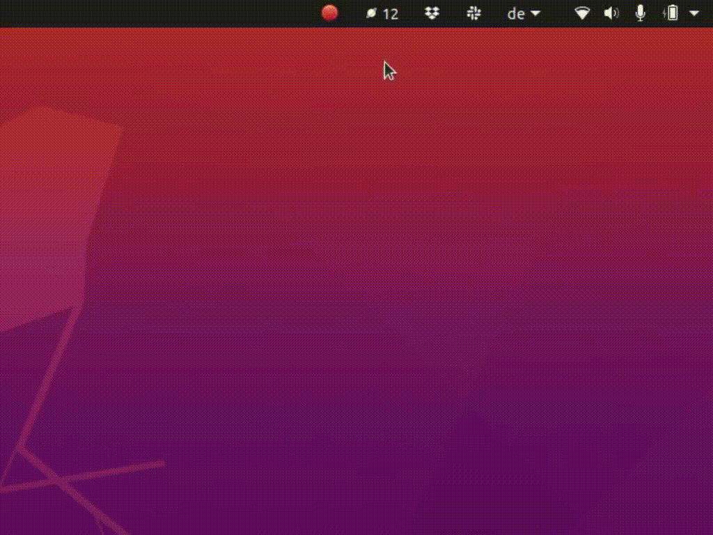

# Astronaut Toolbar



This toolbar element shows you the total number of humans currently in outer space.
They are also grouped by space station.

I came up with this small project to experiment with the GTK-based toolbar on Ubuntu.

The project idea was based on a blog post that mentioned the project [Open APIs From Space](http://open-notify.org/). 
I wasn't able to find the blog post again.

The icon used in the toolbar is based on [this SVG icon on Wikimedia Commons](https://commons.wikimedia.org/wiki/File:Icon_planet.svg), which is available in the public domain.  

## Autostart Setup

To have the application start automatically when you log into your Ubuntu desktop, you will need to create an entry in the "Startup Applications" utility. Follow these steps to set up autostart using the provided [astronaut_toolbar.desktop](astronaut_toolbar) file.

If you haven't already cloned the repository, you can do so with the following command:

```bash
git clone https://github.com/tonyromarock/astronaut_toolbar.git ~/git
```

Ensure that the script is executable by changing its permissions:
```
chmod +x ~/git/astronaut_toolbar/astronaut_toolbar.py
```

Copy the `astronaut_toolbar.desktop` file from the cloned repository to the autostart directory:

```
cp ~/git/astronaut_toolbar/astronaut_toolbar.desktop ~/.config/autostart/
```

Check the "Startup Applications" utility to verify the setup. Restart your computer to test automatic startup on login.
